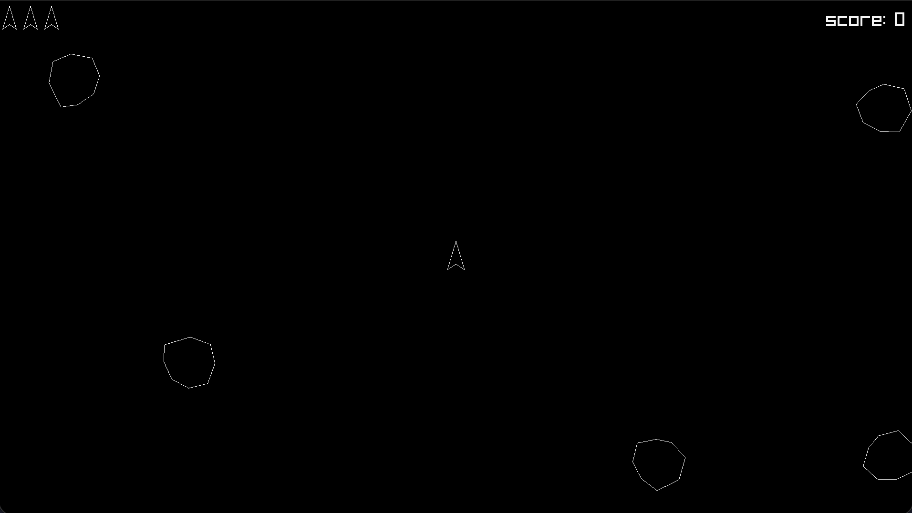

# Blasteroids (Asteroids Clone)



This repository contains the source code for my Blasteroids clone. If you are
coming from YouTube, this is the project from the video where I build the game.

## Build & Run

- Uses raylib and a Makefile.
- I develop on macOS (Homebrew raylib). Your include/library paths may differ.

```sh
make
make run
```

To clean:

```sh
make clean
```
